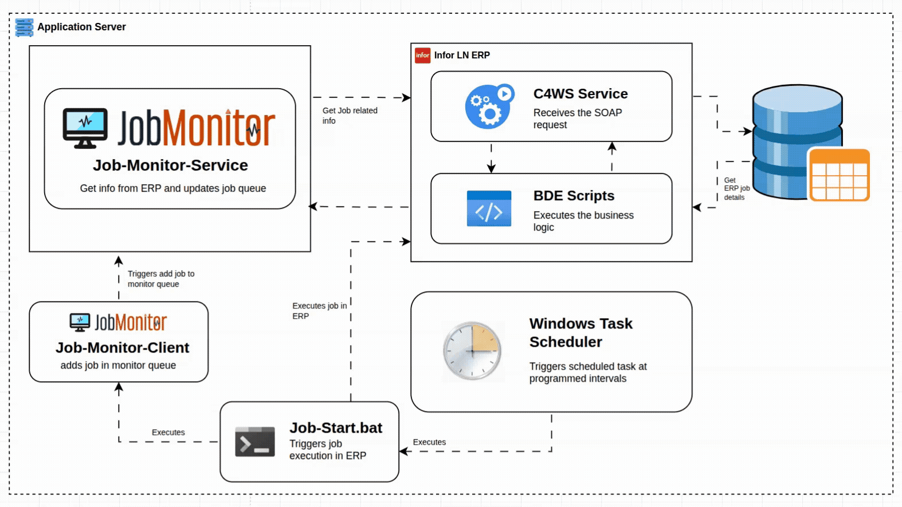
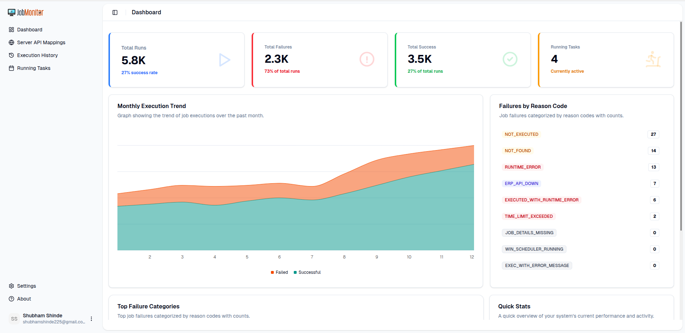
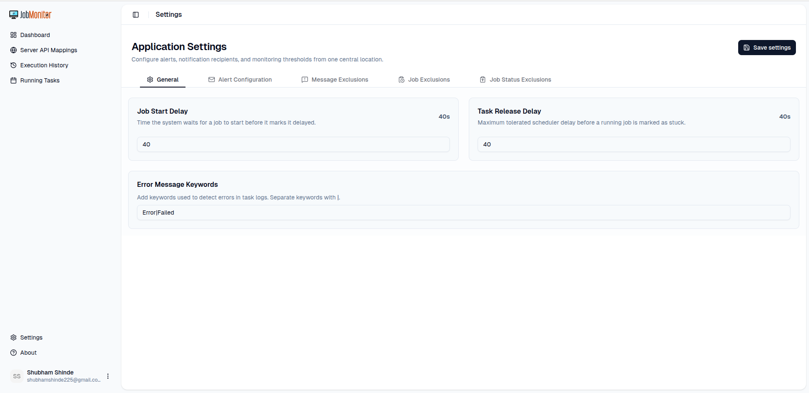
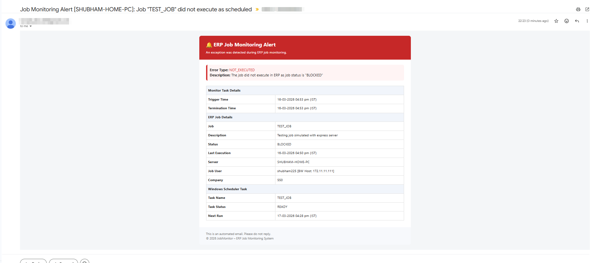

# 


Job Monitor is a multi-module system for monitoring **Infor LN ERP** jobs and sending alerts when executions fail or breach SLAs.  
It consists of a Spring Boot backend, a modern Next.js web UI, and CLI tools for easy integration with existing schedulers.

---

## Modules

- `job-monitor-cli` – legacy Java-based CLI for interacting with the server
- `job-monitor-cli-rs` – modern Rust-based CLI (recommended)
- `job-monitor-common` – shared Java models and utilities
- `job-monitor-core` – core domain and business logic
- `job-monitor-server` – Spring Boot backend for monitoring and alerts
- `job-monitor-web` – Next.js web UI

Each module has its own `README.md` with more detailed information.

---

## High-Level Architecture

- **CLIs (`job-monitor-cli`, `job-monitor-cli-rs`)**  
  Register jobs and push execution results (success/failure) to the backend.

- **Backend (`job-monitor-server`, `job-monitor-core`, `job-monitor-common`)**  
  Stores job definitions and history, evaluates alert rules, and sends notifications (e.g., email).

- **Web UI (`job-monitor-web`)**  
  Visualizes job status and history, and provides configuration and administration views.


---

## Getting Started

### Prerequisites

- Java 17+
- Maven
- Node.js (LTS) for the web UI
- Rust toolchain (`rustup`) for the Rust CLI (optional but recommended)
- SMTP credentials for email alerts

### Typical Local Setup

1. **Build backend modules**

   ```bash
   mvn clean package
   ```

2. **Run the server**

   ```bash
   cd job-monitor-server
   mvn spring-boot:run
   ```

3. **Run the web UI**

   ```bash
   cd ../job-monitor-web
   npm install
   npm run dev
   ```

4. **Build and use the Rust CLI (optional)**

   ```bash
   cd ../job-monitor-cli-rs
   cargo build --release
   ./target/release/job-monitor-cli --help
   ```

---

## Configuration Overview

Common environment variables used across modules:

| Variable                 | Used In                | Description                                  |
|--------------------------|------------------------|----------------------------------------------|
| `JOB_MONITOR_SERVER_URL` | CLIs, web UI           | Base URL of `job-monitor-server`             |
| `JOB_MONITOR_HOME`       | Server, CLIs           | Directory for logs/data                      |
| `JOB_MONITOR_PORT`       | Server                 | HTTP port for the backend                    |
| `MAIL_USER`              | Server                 | Email sender for alerts                      |
| `MAIL_PASSWORD`          | Server                 | SMTP password or app-specific token          |
| `NEXT_PUBLIC_JOB_MONITOR_SERVER_URL` | Web UI   | Public server URL exposed to the browser     |

Check the individual module README's and configuration files for full details.

---
## Screenshot
### Homepage


### Settings


### Alert Email Template


---
## ERP Integration Contract

The ERP Monitor application expects the following request and response formats. A middleware can be used to transform these requests/responses to the ERP-specific API.

### 1. Fetch Job Details

**Request**

```json
{
  "jobCode": "JOB001",
  "company": "COMP01"
}
```

**Response**

```json
{
  "jobCode": "JOB001",
  "company": "COMP01",
  "hostDisplayName": "ERP-SERVER-01",
  "description": "Daily Invoice Processing",
  "status": "RUNNING",
  "historyStatus": "SUCCESS",
  "userId": "SYSTEM",
  "jobStartedAt": "2026-07-02T10:15:00",
  "jobEndedAt": "2026-07-02T10:18:30",
  "nextJobExecutionAt": "2026-07-03T10:15:00",
  "jobAverageRuntimeInSec": 210,
  "jobNotFound": false
}
```

### 2. Fetch Job History Error Messages

**Request**

```json
{
  "jobCode": "JOB001",
  "company": "COMP01"
}
```

**Response**

```json
[
  {
    "jobCode": "JOB001",
    "company": "COMP01",
    "message": "Unable to connect to database."
  },
  {
    "jobCode": "JOB001",
    "company": "COMP01",
    "message": "Retry completed successfully."
  }
]
```

> **Note:** The middleware may expose any ERP-specific endpoints internally, but it must accept and return data in the formats shown above so that the ERP Monitor application can interact with it without modification.

---
## License
This project is licensed under the MIT License - see the [LICENSE](LICENSE) file for details.


