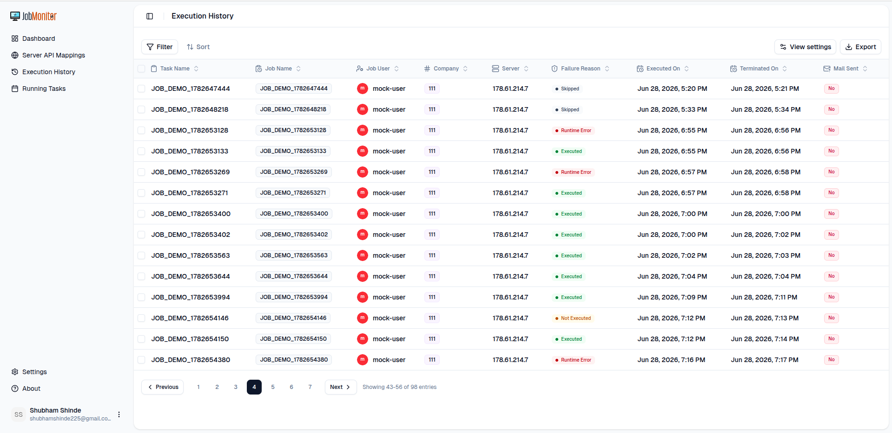
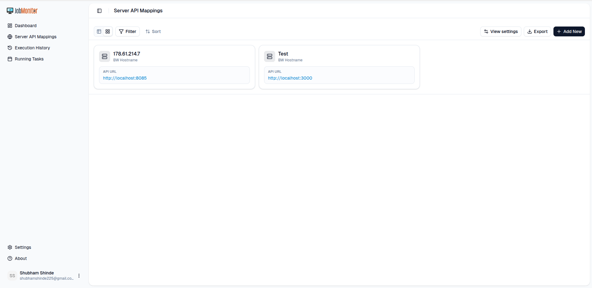

# 


**Job Monitor** is a multi-module system for monitoring **Infor LN ERP** jobs and sending alerts when executions fail or breach SLAs. It consists of a Spring Boot backend, a modern Next.js web UI, and a lightweight client for integrating with existing schedulers.

---

## Table of Contents

- [Modules](#modules)
- [Architecture](#architecture)
- [Getting Started](#getting-started)
- [Configuration](#configuration)
- [Screenshots](#screenshots)
- [ERP Integration Contract](#erp-integration-contract)
- [License](#license)

---

## Modules

| Module               | Description                                                  |
|----------------------|--------------------------------------------------------------|
| `job-monitor-client` | Rust-based client for registering jobs to server             |
| `job-monitor-server` | Spring Boot backend that stores job data and triggers alerts |
| `job-monitor-core`   | Core domain models and business logic                        |
| `job-monitor-common` | Shared utilities used across backend modules                 |
| `job-monitor-web`    | Next.js web UI for visualization and administration          |

Each module includes its own `README.md` with setup and usage details specific to that module.

---

## Architecture

- **Client** (`job-monitor-client`)
  Registers jobs with the server and reports execution results (success/failure).

- **Backend** (`job-monitor-server`, `job-monitor-core`, `job-monitor-common`)
  Stores job definitions and execution history, evaluates alert rules, and dispatches notifications (e.g., email).

- **Web UI** (`job-monitor-web`)
  Provides dashboards for job status and history, along with configuration and administration views.


---

## Getting Started

### Prerequisites

- Java 17+
- Maven
- Node.js (LTS), for the web UI
- Rust toolchain (`rustup`), for the recommended client
- SMTP credentials, for email alerts

### Local Setup

1. **Build the backend modules**

   ```bash
   mvn clean package
   ```

2. **Run the server**

   ```bash
   cd job-monitor-server
   mvn spring-boot:run
   ```

3. **Run the web UI**

   ```bash
   cd ../job-monitor-web
   yarn install
   yarn dev
   ```

4. **Build and run the recommended client**

   ```bash
   cd ../job-monitor-client
   
   # Linux/macOS
   ./build.sh

   # Windows
   build.bat
   ```

---

## Configuration

Common environment variables used across modules:

| Variable                             | Used In        | Description                         |
|--------------------------------------|----------------|-------------------------------------|
| `JOB_MONITOR_SERVER_URL`             | Client, Web UI | Base URL of `job-monitor-server`    |
| `JOB_MONITOR_HOME`                   | Server, Client | Directory for logs and data         |
| `JOB_MONITOR_PORT`                   | Server         | HTTP port for the backend           |
| `MAIL_USER`                          | Server         | Sender address for email alerts     |
| `MAIL_PASSWORD`                      | Server         | SMTP password or app-specific token |

See the individual module READMEs for the full configuration reference.

---

## Screenshots

### Homepage


### Job Execution History


### Server Mapping


### Settings


### Alert Email Template


---

## ERP Integration Contract

The ERP Monitor application expects requests and responses in the formats below. A middleware layer can be used to translate these into ERP-specific API calls, as long as it preserves this contract.

### 1. Fetch Job Details

**Request**

```json
{
  "jobCode": "JOB001",
  "company": "COMP01"
}
```

**Response**

```json
{
  "jobCode": "JOB001",
  "company": "COMP01",
  "hostDisplayName": "ERP-SERVER-01",
  "description": "Daily Invoice Processing",
  "status": "RUNNING",
  "historyStatus": "SUCCESS",
  "userId": "SYSTEM",
  "jobStartedAt": "2026-07-02T10:15:00",
  "jobEndedAt": "2026-07-02T10:18:30",
  "nextJobExecutionAt": "2026-07-03T10:15:00",
  "jobAverageRuntimeInSec": 210,
  "jobNotFound": false
}
```

### 2. Fetch Job History Error Messages

**Request**

```json
{
  "jobCode": "JOB001",
  "company": "COMP01"
}
```

**Response**

```json
[
  {
    "jobCode": "JOB001",
    "company": "COMP01",
    "message": "Unable to connect to database."
  },
  {
    "jobCode": "JOB001",
    "company": "COMP01",
    "message": "Retry completed successfully."
  }
]
```

> **Note:** The middleware may expose any ERP-specific endpoints internally, but must accept and return data in the formats shown above so the ERP Monitor application can integrate without modification.

---

## License

This project is licensed under the MIT License, see the [LICENSE](LICENSE) file for details.